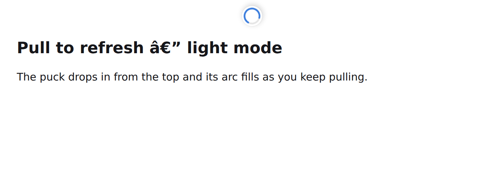

# Pull to Refresh

A Firefox / Zen extension that reloads the page when you overscroll upward at the
very top — the same gesture mobile browsers use.



## How the trigger works

It only fires when **both** are true:

1. The page (and every scrollable container under your cursor) is already at its top.
2. You start a *new* scroll-up gesture from that state and keep going past the
   pull threshold (150 px by default).

Point 2 is the important one. Trackpad momentum after a fast flick upward is a
continuous stream of wheel events, so it belongs to the gesture that *started*
while you were scrolled down — it can never trigger a reload. You have to stop,
then deliberately scroll up again. This is what keeps it from firing by accident.

Touchscreens are supported too: pull down with one finger at the top of the page.

## Install in Zen

Zen is built on Firefox release, which enforces add-on signing, so
`xpinstall.signatures.required` won't help. Two options:

**Temporary (instant, gone on restart)** — good for trying it out:

1. Open `about:debugging#/runtime/this-firefox`
2. Click **Load Temporary Add-on…**
3. Select `manifest.json` from this folder

**Permanent** — self-sign through Mozilla (free, no review, not listed publicly):

```bash
npm install -g web-ext
# get an API key + secret at https://addons.mozilla.org/developers/addon/api/key/
web-ext sign --channel=unlisted --api-key=<key> --api-secret=<secret>
```

That drops a signed `.xpi` in `web-ext-artifacts/`. Drag it onto Zen to install
for good.

Or do it through the web UI: build a zip of this folder's contents (with
`manifest.json` at the top level), upload it at
https://addons.mozilla.org/developers/addon/submit/ and choose **"On your own"**.
Once it's signed, download the signed `.xpi` from the Developer Hub under
*Manage Status & Versions*. Note that each new upload needs a bumped `version`
in `manifest.json` — AMO rejects a version it has already signed.

The `.xpi` attached to the GitHub release is **unsigned**; Firefox and Zen will
refuse to install it permanently. Use it as a build input for signing, or load it
temporarily via `about:debugging`.

## Settings

`about:addons` → Pull to Refresh → **Preferences**

| Setting | Default | Notes |
| --- | --- | --- |
| Enabled | on | Master switch |
| Pull distance | 150 px | Raise it if it ever fires when you didn't mean it |
| Indicator | Spinner arc | Or a thin top progress bar, or nothing |
| Blocklist | empty | One hostname per line; subdomains match automatically, `*.example.com` works too |

Worth blocklisting anything where an accidental reload costs you work —
`mail.google.com`, `docs.google.com`, `*.figma.com`, your own localhost apps.

## Files

```
manifest.json     MV2 manifest — storage permission only, no network access
content.js        gesture detection + shadow-DOM indicator
options.html/js   settings page
icons/icon.svg    toolbar icon
test/harness.mjs  headless behaviour tests (node test/harness.mjs)
```

## Tests

```bash
npm install --no-save playwright
node test/harness.mjs
```

Nine checks, including the momentum false-positive case and pulls inside nested
scroll containers. Reloads are counted server-side because `location.reload` is
unforgeable and can't be stubbed.

## Notes

- Manifest V2, because Firefox MV3 treats `<all_urls>` as an optional permission
  the user must grant by hand in `about:addons`. MV2 grants it at install.
- The indicator lives in a closed shadow root, so page CSS can't touch it and it
  can't touch the page.
- Runs in the top frame only — iframes never trigger a reload.
- No network permissions, no background script, no data leaves the browser.
